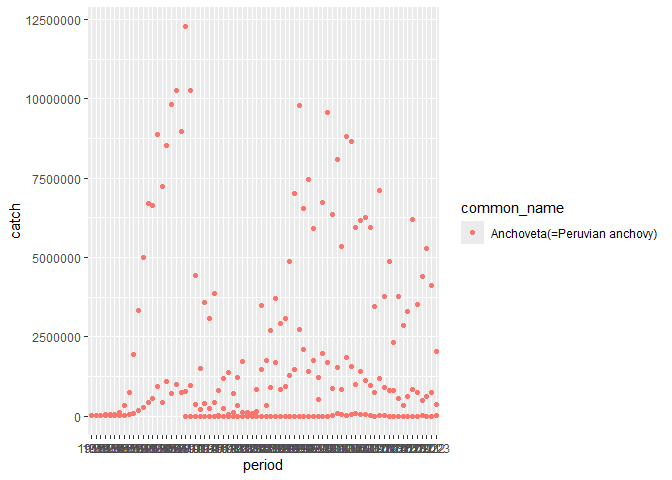
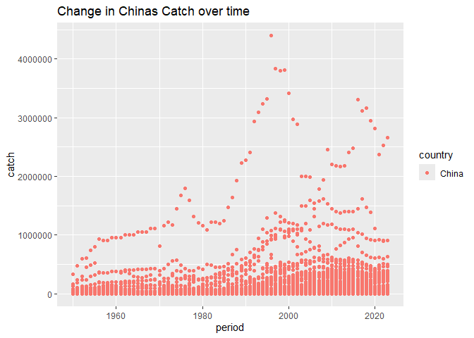

## Instructions
Answer the following questions and/or complete the exercises in RMarkdown. Please embed all of your code and push the final work to your repository. Your report should be organized, clean, and run free from errors. Remember, you must remove the `#` for any included code chunks to run.  

## Load the libraries

``` r
library("tidyverse")
library("janitor")
library("naniar")
options(scipen = 999)
```

## About the Data
For this assignment we are going to work with a data set from the [United Nations Food and Agriculture Organization](https://www.fao.org/fishery/en/collection/capture) on world fisheries. These data were downloaded and cleaned using the `fisheries_clean.Rmd` script.  

Load the data `fisheries_clean.csv` as a new object titled `fisheries_clean`.

``` r
fisheries_clean <- read_csv("data/fisheries_clean.csv")
```

1. Explore the data. What are the names of the variables, what are the dimensions, are there any NA's, what are the classes of the variables, etc.? You may use the functions that you prefer.

``` r
summary(fisheries_clean)
```

```
##      period      continent          geo_region          country         
##  Min.   :1950   Length:1055015     Length:1055015     Length:1055015    
##  1st Qu.:1980   Class :character   Class :character   Class :character  
##  Median :1996   Mode  :character   Mode  :character   Mode  :character  
##  Mean   :1994                                                           
##  3rd Qu.:2010                                                           
##  Max.   :2023                                                           
##  scientific_name    common_name        taxonomic_code         catch           
##  Length:1055015     Length:1055015     Length:1055015     Min.   :       0.0  
##  Class :character   Class :character   Class :character   1st Qu.:       0.0  
##  Mode  :character   Mode  :character   Mode  :character   Median :       2.9  
##                                                           Mean   :    5089.9  
##                                                           3rd Qu.:     400.0  
##                                                           Max.   :12277000.0  
##     status         
##  Length:1055015    
##  Class :character  
##  Mode  :character  
##                    
##                    
## 
```

2. Convert the following variables to factors: `period`, `continent`, `geo_region`, `country`, `scientific_name`, `common_name`, `taxonomic_code`, and `status`.

``` r
fisheries_clean_f <- fisheries_clean %>%
  mutate(across(where(is.character), as.factor)) %>%
  mutate(period=as.factor(period))
```

``` r
glimpse(fisheries_clean_f)
```

```
## Rows: 1,055,015
## Columns: 9
## $ period          <fct> 1950, 1951, 1952, 1953, 1954, 1955, 1956, 1957, 1958, …
## $ continent       <fct> Asia, Asia, Asia, Asia, Asia, Asia, Asia, Asia, Asia, …
## $ geo_region      <fct> Southern Asia, Southern Asia, Southern Asia, Southern …
## $ country         <fct> "Afghanistan", "Afghanistan", "Afghanistan", "Afghanis…
## $ scientific_name <fct> "Osteichthyes", "Osteichthyes", "Osteichthyes", "Ostei…
## $ common_name     <fct> "Freshwater fishes NEI", "Freshwater fishes NEI", "Fre…
## $ taxonomic_code  <fct> 1990XXXXXXXX106, 1990XXXXXXXX106, 1990XXXXXXXX106, 199…
## $ catch           <dbl> 100, 100, 100, 100, 100, 200, 200, 200, 200, 200, 200,…
## $ status          <fct> A, A, A, A, A, A, A, A, A, A, A, A, A, A, A, A, A, A, …
```


##3. Are there any missing values in the data? If so, which variables contain missing values and how many are missing for each variable?

``` r
#Skip
```

4. How many countries are represented in the data?

``` r
fisheries_clean_f %>%
  distinct(country)
```

```
## # A tibble: 249 × 1
##    country            
##    <fct>              
##  1 Afghanistan        
##  2 Albania            
##  3 Algeria            
##  4 American Samoa     
##  5 Andorra            
##  6 Angola             
##  7 Anguilla           
##  8 Antigua and Barbuda
##  9 Argentina          
## 10 Armenia            
## # ℹ 239 more rows
```

``` r
#There are 249 countries represented
```

5. The variables `common_name` and `taxonomic_code` both refer to species. How many unique species are represented in the data based on each of these variables? Are the numbers the same or different?

``` r
fisheries_clean_f %>%
  distinct(common_name, taxonomic_code)
```

```
## # A tibble: 3,722 × 2
##    common_name             taxonomic_code 
##    <fct>                   <fct>          
##  1 Freshwater fishes NEI   1990XXXXXXXX106
##  2 Crucian carp            140014109002   
##  3 Common carp             140014113401   
##  4 Grass carp(=White amur) 140018102601   
##  5 Silver carp             140018104601   
##  6 Bighead carp            140018104602   
##  7 Wuchang bream           140018105801   
##  8 Bleak                   140023102602   
##  9 Orfe(=Ide)              140023114204   
## 10 Common dace             140023114205   
## # ℹ 3,712 more rows
```

``` r
#There are 3,722 species present in the data
```

6. In 2023, what were the top five countries that had the highest overall catch?

``` r
fisheries_clean_f %>%
  select(period, country, catch) %>%
filter(period == "2023") %>%
  arrange(desc(catch))
```

```
## # A tibble: 17,665 × 3
##    period country                     catch
##    <fct>  <fct>                       <dbl>
##  1 2023   China                    2661523.
##  2 2023   Viet Nam                 2190211.
##  3 2023   Peru                     2047732.
##  4 2023   Russian Federation       1893580 
##  5 2023   United States of America 1433538 
##  6 2023   Bangladesh               1040470 
##  7 2023   China                     910275 
##  8 2023   China                     908467 
##  9 2023   Myanmar                   902360 
## 10 2023   Chile                     852831 
## # ℹ 17,655 more rows
```

``` r
#The top 5 with the highest overall catch in 2023 was China, Vietnam, Peru, Russia, US, Bangladesh
```

7. In 2023, what were the top 10 most caught species? To keep things simple, assume `common_name` is sufficient to identify species. What does `NEI` stand for in some of the common names? How might this be concerning from a fisheries management perspective?

``` r
fisheries_clean_f %>%
  select(period,common_name, catch) %>%
filter(period == "2023") %>%
  arrange(desc(catch))
```

```
## # A tibble: 17,665 × 3
##    period common_name                       catch
##    <fct>  <fct>                             <dbl>
##  1 2023   Marine fishes NEI              2661523.
##  2 2023   Marine fishes NEI              2190211.
##  3 2023   Anchoveta(=Peruvian anchovy)   2047732.
##  4 2023   Alaska pollock(=Walleye poll.) 1893580 
##  5 2023   Alaska pollock(=Walleye poll.) 1433538 
##  6 2023   Freshwater fishes NEI          1040470 
##  7 2023   Largehead hairtail              910275 
##  8 2023   Freshwater fishes NEI           908467 
##  9 2023   Freshwater fishes NEI           902360 
## 10 2023   Chilean jack mackerel           852831 
## # ℹ 17,655 more rows
```

``` r
#The top 5 species caught in 2023 were Marine fishes NEI, Peruvian Anchovy, Walleye Poll,Freshwater fishes NEI, Chilean Jack Mackerel.
```

8. For the species that was caught the most above (not NEI), which country had the highest catch in 2023?

``` r
fisheries_clean_f %>%
  select(period, country, catch, common_name) %>%
  filter(common_name== "Anchoveta(=Peruvian anchovy)", period == "2023") %>%
  arrange(desc(catch))
```

```
## # A tibble: 3 × 4
##   period country    catch common_name                 
##   <fct>  <fct>      <dbl> <fct>                       
## 1 2023   Peru    2047732. Anchoveta(=Peruvian anchovy)
## 2 2023   Chile    353267  Anchoveta(=Peruvian anchovy)
## 3 2023   Ecuador   14710. Anchoveta(=Peruvian anchovy)
```

``` r
# Peru had the highest catch of Anchoveta(=Peruvian anchovy) in 2023.
```

9. How has fishing of this species changed over the last decade (2013-2023)? Create a  plot showing total catch by year for this species.

``` r
fisheries_clean_f %>%
  select(period, catch, common_name) %>%
  filter(common_name == "Anchoveta(=Peruvian anchovy)") %>%
  ggplot(mapping = aes(x=period, y=catch))+ geom_point(mapping = aes(colour = common_name))
```

<!-- -->

10. Perform one exploratory analysis of your choice. Make sure to clearly state the question you are asking before writing any code.

``` r
#How has the catch of China changed overtime
fisheries_clean %>%
  select(period, country, catch) %>%
  filter(country== "China") %>%
  ggplot(mapping = aes(x=period, y= catch))+
  geom_point(mapping = aes(colour = country)) + labs(title = "Change in Chinas Catch over time")
```

<!-- -->

## Knit and Upload
Please knit your work as an .html file and upload to Canvas. Homework is due before the start of the next lab. No late work is accepted. Make sure to use the formatting conventions of RMarkdown to make your report neat and clean!  
